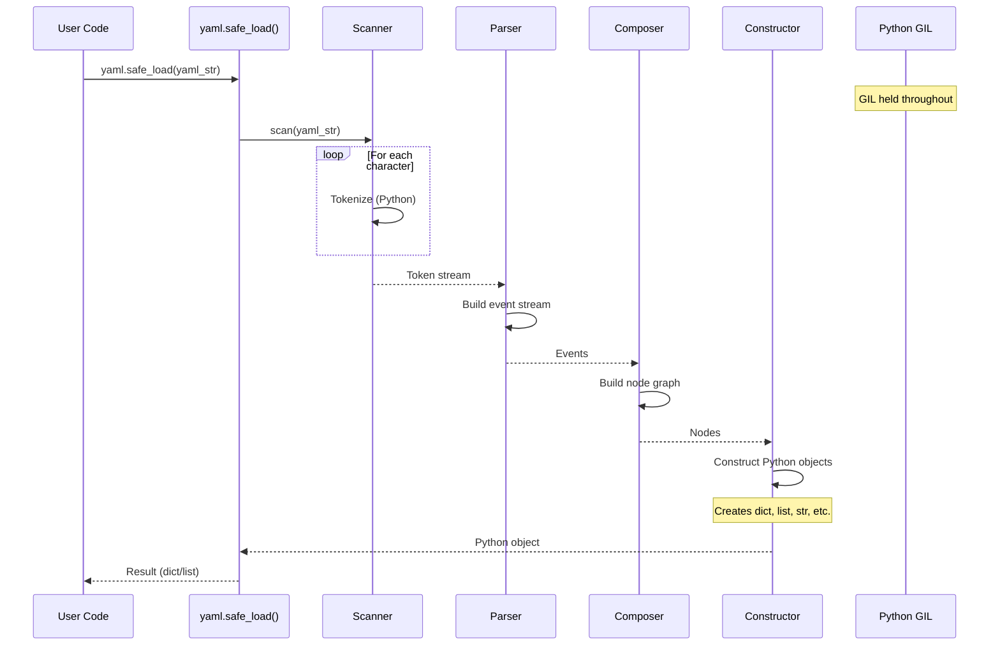

# RustyAML Architecture & Flow Diagrams

This document visualizes the architecture and data flow of RustyAML compared to PyYAML.

## Table of Contents

1. [High-Level Architecture Comparison](#high-level-architecture-comparison)
2. [Parsing Flow](#parsing-flow)
3. [Safety Check Flow](#safety-check-flow)
4. [Batch Processing Flow](#batch-processing-flow)
5. [Memory & Performance](#memory--performance)
6. [Component Diagrams](#component-diagrams)

---

## High-Level Architecture Comparison

### PyYAML Architecture

### RustyAML Architecture

---

## Parsing Flow

### PyYAML Parsing Flow (Pure Python)

### RustyAML Parsing Flow

---

## Safety Check Flow

### PyYAML Safety Model

```mermaid
flowchart TD
    Input["YAML Input"] --> Loader{"Which Loader?"}
    
    Loader -->|"yaml.load()"| Unsafe["⚠️ UNSAFE<br/>Executes arbitrary code"]
    Loader -->|"yaml.safe_load()"| Safe["SafeLoader"]
    Loader -->|"yaml.unsafe_load()"| Unsafe
    
    Safe --> Construct["Limited Constructors"]
    Construct --> BasicTypes["Only basic types:<br/>dict, list, str, int, float, bool, None"]
    
    Unsafe --> AllConstructors["All Constructors"]
    AllConstructors --> Danger["!!python/object<br/>!!python/module<br/>!!python/apply<br/>etc."]
    Danger --> RCE["🔴 Remote Code Execution"]
    
    style Unsafe fill:#ff6b6b,color:#fff
    style RCE fill:#ff0000,color:#fff
    style Safe fill:#51cf66,color:#fff
    style BasicTypes fill:#90EE90,color:#000
```

### RustyAML Safety Model

### Safety Check Details

```mermaid
flowchart LR
    subgraph Phase1["Phase 1: Quick Scan"]
        Raw["Raw YAML String"]
        Regex["Pattern Matching"]
        Tags["Dangerous Tags:<br/>!!python/object<br/>!!python/object/apply<br/>!!python/module<br/>!!python/name<br/>!!python/object/new"]
    end
    
    subgraph Phase2["Phase 2: Deep Check"]
        AST["Parsed AST"]
        Recurse["Recursive Walk"]
        TagCheck["Check serde_yaml::Value::Tagged"]
    end
    
    Raw --> Regex
    Regex --> Tags
    Tags -->|"Found"| Block1["🛑 Block"]
    Tags -->|"Not found"| AST
    AST --> Recurse
    Recurse --> TagCheck
    TagCheck -->|"Dangerous"| Block2["🛑 Block"]
    TagCheck -->|"Safe"| Allow["✅ Allow"]
    
    style Block1 fill:#ff6b6b,color:#fff
    style Block2 fill:#ff6b6b,color:#fff
    style Allow fill:#51cf66,color:#fff
```

---

## Batch Processing Flow

### PyYAML Batch Processing (Sequential)

### RustyAML Batch Processing (Parallel)

```mermaid
sequenceDiagram
    participant User as User Code
    participant Wrapper as rustyaml
    participant GIL as Python GIL
    participant Rayon as Rayon Thread Pool
    participant T1 as Thread 1
    participant T2 as Thread 2
    participant T3 as Thread 3
    participant T4 as Thread 4
    
    User->>Wrapper: safe_load_many(100 yamls)
    Wrapper->>GIL: Release GIL
    
    Note over GIL: GIL released!
    
    Wrapper->>Rayon: par_iter(yamls)
    
    par [Parallel Parsing]
        Rayon->>T1: Parse files 1-25
        Rayon->>T2: Parse files 26-50
        Rayon->>T3: Parse files 51-75
        Rayon->>T4: Parse files 76-100
        
        T1-->>Rayon: Results 1-25
        T2-->>Rayon: Results 26-50
        T3-->>Rayon: Results 51-75
        T4-->>Rayon: Results 76-100
    end
    
    Rayon-->>Wrapper: All parsed values
    
    Wrapper->>GIL: Re-acquire GIL
    Note over GIL: GIL re-acquired
    
    Wrapper->>Wrapper: Convert all to Python
    Wrapper-->>User: List of 100 results
    
    Note over User,T4: Total time ≈ max(thread times) + conversion
```

### Parallel Processing Visualization

---

## Memory & Performance

### Memory Model Comparison

### Performance Comparison

---

## Component Diagrams

### RustyAML Module Structure

```mermaid
classDiagram
    class rustyaml {
        +safe_load(yaml: str) → Any
        +safe_load_all(yaml: str) → List
        +unsafe_load(yaml: str) → Any
        +safe_load_many(yamls: List[str]) → List
        +safe_load_file(path: Path) → Any
        +load_directory(path: Path) → Dict
    }
    
    class lib_rs {
        <<PyO3 Module>>
        +rustyaml_module(m: PyModule)
        -parse_yaml(py: Python, yaml: str) → PyObject
        -parse_yaml_all(py: Python, yaml: str) → PyList
        -parse_yaml_many(py: Python, yamls: Vec) → PyList
    }
    
    class parser_rs {
        +parse_safe(yaml: &str) → Result~Value~
        +parse_unsafe(yaml: &str) → Result~Value~
        +parse_all(yaml: &str) → Result~Vec~Value~~
        +parse_with_context(yaml: &str) → Result~Value~
    }
    
    class types_rs {
        +yaml_to_python(py: Python, value: Value) → PyResult~PyObject~
        -convert_mapping(py: Python, map: Mapping) → PyDict
        -convert_sequence(py: Python, seq: Sequence) → PyList
        -convert_scalar(py: Python, value: Value) → PyObject
    }
    
    class safe_rs {
        +check_safety(value: &Value) → Result~()~
        +quick_safety_check(yaml: &str) → Result~()~
        -is_dangerous_tag(tag: &str) → bool
        -UNSAFE_PATTERNS: [&str]
    }
    
    class batch_rs {
        +safe_load_many(yamls: Vec~String~) → Vec~Value~
        +load_directory(path: &Path) → HashMap~String, Value~
        -parse_parallel(yamls: &[String]) → Vec~Result~Value~~
    }
    
    class error_rs {
        <<enum>> YAMLError
        +ParseError
        +SafetyError
        +IOError
        +to_py_err() → PyErr
    }
    
    rustyaml --> lib_rs : FFI calls
    lib_rs --> parser_rs : uses
    lib_rs --> types_rs : uses
    lib_rs --> batch_rs : uses
    parser_rs --> safe_rs : uses
    batch_rs --> parser_rs : uses
    parser_rs --> error_rs : returns
    safe_rs --> error_rs : returns
```

### Data Flow Through Components

---

## Error Handling Flow

```mermaid
flowchart TD
    Input["YAML Input"] --> Parse["Attempt Parse"]
    
    Parse --> SyntaxCheck{"Syntax Valid?"}
    SyntaxCheck -->|"No"| SyntaxError["ParseError<br/>with line/column info"]
    
    SyntaxCheck -->|"Yes"| SafetyCheck{"Safety Check"}
    SafetyCheck -->|"Dangerous tags"| SafetyError["SafetyError<br/>with tag location"]
    
    SafetyCheck -->|"Safe"| Convert["Convert to Python"]
    Convert --> TypeCheck{"Type Conversion OK?"}
    
    TypeCheck -->|"No"| ConvError["ConversionError"]
    TypeCheck -->|"Yes"| Success["✅ Return Result"]
    
    SyntaxError --> PyError["Python ValueError"]
    SafetyError --> PyError
    ConvError --> PyError
    
    PyError --> UserCode["User's try/except"]
    
    style SyntaxError fill:#ff6b6b,color:#fff
    style SafetyError fill:#ff6b6b,color:#fff
    style ConvError fill:#ff6b6b,color:#fff
    style Success fill:#51cf66,color:#fff
```

---

## Summary: Key Differences

---

## Viewing These Diagrams

These diagrams are written in [Mermaid](https://mermaid.js.org/) syntax. To view them:

1. **GitHub**: GitHub automatically renders Mermaid in markdown files
2. **VS Code**: Install the "Markdown Preview Mermaid Support" extension
3. **Online**: Paste into [Mermaid Live Editor](https://mermaid.live/)
4. **Documentation**: Most modern doc tools (MkDocs, Docusaurus) support Mermaid

---

*Generated for RustyAML v0.1.0*